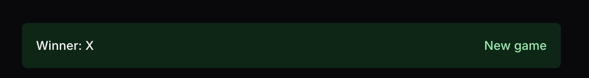

## Junior Developer Coding Challenge — Tic Tac Toe

You’ll take this small Next.js + React app and complete a few bug fixes and features. The scope is intentionally small and should take around 1–2 hours.

Important constraints

- Do not use AI tools to complete the task.
- Prefer Tailwind CSS utilities over inline styles or custom CSS where possible.
- Keep changes focused and readable; small, clear commits are ideal.

Submission

- Fork this repository to your own GitHub account.
- Do your work on your fork (main or a feature branch is fine).
- When finished, send us the link to your fork (and optionally a link to a PR within your fork summarizing your changes).

What we’re looking for

- Working functionality that matches the acceptance criteria.
- Clean, idiomatic React (function components, hooks) and Tailwind usage.
- Sensible component structure and state updates; avoid unnecessary re-renders.
- Clear commit history and concise README notes if anything is unfinished.

Notes about the code

- The core game logic is already implemented in `src/utils/game.ts`. You should NOT need to change this file.
- State is managed with a reducer in `src/reducers/game.ts` and provided via `GameContext`.
- UI lives under `src/components/` and pages under `src/app/` (App Router).

## Getting Started

After installing dependencies (`npm install`)

First, run the development server:

```bash
npm run dev
```

Open http://localhost:3000 with your browser to see the app.

## Tasks

### Bug fixing

1. Winner/tie alert styling

Note: The logic to show the result of a game (Winner/Tied Game) is already implemented

- Update the styling of the result to match the alert component pictured below.
- We are looking for a close enough match - it does not have to be pixel perfect



2. Reset/New Game button doesn’t work

- The “New Game” button should reset the game however currently it doesn't work.
- Reloading the page is NOT an acceptable solution

3. Clicking the same cell twice flips it

- Prevent placing on non-empty cells. Clicking an occupied square should do nothing.
- Disallow further moves after a win or tie.

Acceptance criteria (bugs)

- The alert is styled with Tailwind classes and is visually distinct.
- Clicking “New Game” reliably clears the board and alternates the starting player according to existing logic.
- Clicking an already-occupied cell has no effect; no state flips from X to O or vice versa. No moves are allowed after game end.

### Add features

1. Game type switch (PVP ↔ PVC)

- Provide a simple UI control to toggle between PVP and PVC.
- Use the existing reducer action to update the game type and trigger a reset.
- Persist the selection across reloads (e.g., localStorage).

2. Player names and a settings page

- Add a `/settings` page where users can set names.
  - Defaults: Player 1 and Player 2 for PVP; Player 1 and Computer for PVC.
- Persist names in browser storage.
- Provide simple navigation between the game page `/` and `/settings`.

3. Recent results (last 5 games)

- Show a list of the most recent five game results and persist across reloads.
- Track results by Player 1/Player 2 identity (not by X/O), including ties.
- Reset the results list when switching game type (PVP vs PVC).

Acceptance criteria (features)

- Users can switch between PVP and PVC via the UI; the choice persists.
- `/settings` exists and saves names to browser storage; defaults apply per mode. Navigation exists between `/` and `/settings`.
- The last five results are visible, persist across reloads, correctly attribute Player 1/Player 2, include ties, and reset on game-type change.
- Tailwind is used for new UI and to replace obvious inline styles where reasonable.

## Tips

- Keep logic in the reducer and helpers where appropriate; keep components primarily for rendering and dispatching actions.
- Keep styling simple, this is not a design exercise
- Desktop only mode is ok, you don't need to worry about mobile styling or interactions

## Non-goals

- Do not rewrite the core game logic in `src/utils/game.ts`.
- No need to introduce server components, external state libraries, or UI frameworks beyond Tailwind.
- No tests are required

## Definition of done

- All bugs are fixed
- At least items (1)–(3) of the feature list are implemented and meet acceptance criteria.
- The app runs without console errors and the UI is reasonably polished using Tailwind.
- README updated (optional) with any notes, assumptions, or known limitations.
